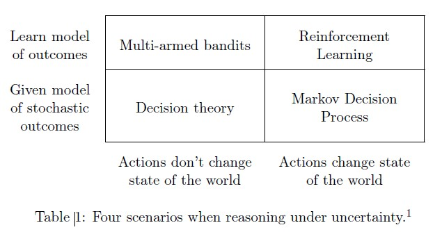

# A Survey on Contextual Multi-armed Bandits

## 1. Introduction

 의사결정과정에서, agent들은 관측지를 바탕으로 결정을 한다. 위의 테이블은 불확실한 상황의 네가지 케이스에서 유형별로 어떤 형태를 활용하여 의사결정하는지를 보여준다. multi-armed bandit(MAB)의 경우에는 모델의 결과는 알 수 없지만 결과는 확률적이거나 적대적이다. 게다가 agent의 행동은 주변의 상태를 변화시키지 않는다.

 해당 paper는 MAB만을 중점적으로 다룬다. 이런 의사결과정에서 Agent는 1,2,3,...,T에 이어지는 결정을 해야하고 각 시점 t의 agent는 K개의 arm들이 있다. arm을 당기고 난 후에, 해당 arm에 대한 보상이 주어지고, 다른 것들의 보상은 모르는 상태이다. 특정 arm의 stochastic setting은 임의의 모르는 분포를 기준으로 얻으며, adversarial setting된 arm의 경우 적대적으로 선택되어지고 어느 분포에서 샘플링될 필요는 없다. 해당 paper에서 관심을 가지고 있는 것은 t 시점에서 얻을 수 있는 side information이다. 이를 'side information the context'라고 부른다. 가장 높은 보상을 줄것으로 기대되는 arm은 different context를 줄 수 있을 것이다. 이러한 multi-armed bandit을 "contextual bandits"이라고 한다.

 contextual bandit문제에서 정책들의 set과 각각의 정책은 arm의 context와 매핑된다. bandit을 통한 분류문제를 해결하는데 있어서 특정 수의 정책들이 주어진다. 그리고, 어느 정책에서도 가장 많은 누적 보상의 기대값을 주는것과 에이전트가 실제로 얻을 수 있는 보상의 차이를 "regret"으로 정의한다. agent의 목표는 regret을 최소화 하는 것이다. C-MAB는 많은 문제에 적용 가능하다. 

e.g) 뉴스 추천 - news 기사: arm; article과 user의 feature - context; Agent는 각각의 유저에 대해 CTR 또는 dwell time을 최대화 하기위한 방식으로 선택을 하게 될 것이다.