# Lecture 9: Linear Bandits and Thompson Sampling

## 1. Introduction

### 1.1. Linear Bandit Background

Linear Bandit은 agent가 각 round별로 arm을 선택하고 그에 대응되는 확률적인 보상을 받는 문제이다. arm별로 주어지는 확률적 보상의 기대값은 알 수 없는 linear function의 형태를 띈다. agent는 n번의 round동안 누적보상을 최대로 하도록 탐색을 한다. 각 round 별로 agent가 선택한 arm은 $e_i$의 형태로 선택된 arm을 제외한 모든 값을 0으로 표현한다. 결과적으로 각각의 arm은 독립적이고, 보상의 확률을 추정하는 계수는 그 arm에 대해서만 의존적임을 알 수 있다.

Bandit을 OFU(the optimisim in the face of uncertainty) principle을 다루는 문제로 규정하고, 이는 얻은 reward를 바탕으로 결정되는 arm의 보상에 대한 선형 함수의 계수들을 특정 구간안에 유지시킴으로써 exploration-exploitation trade-off를 풀어내는 것이다. 각 Round 별로, 신뢰 구간내에서 선형 함수의 계수를 추정하고 예상 reward를 최대화 하는 방향으로 action을 취한다. 이는 과거 round에서 관측했던 action-reward값을 기반으로 한 선형 함수의 계수를 가지고 신뢰 구간을 구성하면서 risk를 줄여나간다. 

그런데, 해당 문제의 중요점은 미래의 arm이 선택되는 것은 과거 선택에 의해 결정되기 떄문에 arm들이 독립적이지 않다는 것이다. 

### 1.2. Learning Model

* 각 round t 마다, arm $X_t$를 Decision set $D=D_t\subseteq{R^d}$에서 선택하고, arm에 해당하는 reward를 $Y_t=<X_t,\Theta_{*}>+\eta_t$ 만큼 얻는다($\Theta_{*}$는 agent에게 알려지지 않은 parameter이고, $\eta_t$는 random noise이다).

* Agent는 n round를 거치는 동안 누적 보상의 기대값을 최대화($\sum^n_{t=1}<X_t,\Theta_*>$)하는 Action들을 찾아야 한다. 

* 최적의 전략은 round t에 기대되는 즉각적인 보상을 최대화하는 arm을 고르는 것이다. $x^*_t=argmax_{x\in{D_t}<x,\Theta_*>}$

* 최적의 전략으로 얻은 누적 보상의 기대값은 $\sum^n_{t=1}<x_t,\Theta_*>$이다.

Regret은 Bandit의 전략과 최적의 전략의 성능을 비교하기 위해 사용된다.
* expected regret: reward에 대해 모두 다 알고 있는 경우 최적 action에 대한 기대값
* pseudo regret: Bandit의 최적 Reward와 수행한 Action으로 얻은 실제 Reward간의 차이로 얻는 기대값

pseudo regret => regret

그리고, reget의 상한선을 추정하기 위한 몇가지 가정들이 필요
1. round 1부터 inf까지의 Decision set Dt는 한정되어 있어야 한다
2. Error $\eta_t$는 conditionally R이 0이상의 상수로 고정된 R-sub-Gaussian를 따라야 한다. 

## 2. Motivating Linear Bandits

linear bandit의 특징은 arm들간의 종속성이다. 2절에서는 어떻게 stochastic bandit으로부터
 linear bandit이 갈라지게 되었는지를 살펴보려고 한다. 특히 stochastic bandit을 linear bandit에 무차별적으로 적용할 때 생기는 잘못들도 살펴보자.

### 2.1. Bounding stochastic proecesses with correlated stopping times

example - bounding a stocahsting process of i.i.d random variables with correlated stopping times

강조점: 왜 stochastic bandit이 linear bandit에 적용될 수 없는지

#### Stochastic Process

확률공간 $(\Omega, F, P)$에 대해, Stochastic Process는 랜덤변수 $Z={Z_t:t\in{T}}$를 연속적으로 나열한 집합이다. 
* $\Omega$: 샘플 공간
* F: 이벤트의 집합
* P: 이벤트가 일어날 확률

#### Stopping time

* Reference

    <a href="https://math.stackexchange.com/questions/1287832/what-is-meant-by-a-stopping-time">https://math.stackexchange.com/questions/1287832/what-is-meant-by-a-stopping-time</a>

주어진 Stochastic Process $Z={Z_n:n\geq{1}}$를 가지고, stopping time은 임의의 시간 $\tau(n\geq1)$에서 시점 n까지의 모든 알려진 정보를 가지고 결정하는 t시점의 event를 말한다($\tau=n$).

i.e. ${Z_1,...,Z_n}$

${Z_1,...,Z_n}$를 i.i.d한 랜덤 변수라고 한다면,

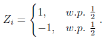

'stochastic process의 기대값'을 고려하는데 있어서,
* stopping time이 고정된 경우
* stopping time이 stochastic process와 연관되어 있는 경우

두 가지 경우에 대해서 살펴본다.

1. stopping time이 $\tau=t\in{n}$와 같이 고정되어 있다면, 기대값은 고정적이다. 

$E[\frac{1}{t}\overset{t}{\underset{i=1}{\sum}}Z_i]=0$

2. stopping time이 stochastic process에 연관되어 있는 경우, $\tau=min\{t:\sum_{t=1}^tZ_i=1\}$

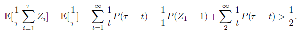

2번의 경우에는 평균값이 불편추정량이 아니다.

1과 2의 기댓값을 가지고 각각의 구간을 계산해보자.

1. stopping time이 고정되어 있는 경우

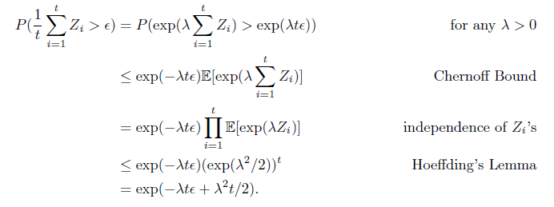

let $\lambda=\epsilon$,

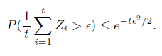

let $\delta=e^{-t\epsilon^2/2}$

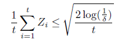

2. stopping time이 union bound를 통해 stochastic process로 연관되어 있는 경우; $\tau=min\{t:\sum_{t=1}^tZ_i=1\}$

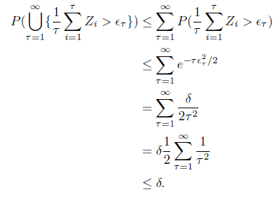

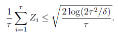

위와 같이 stochastic bandit을 통해 얻은 bound를 arm들이 서로 연관성을 가지는 linear bandit에 적용해보고, 왜 이 방법이 적합하지 않은지에 대해 알아보자.

### 2.2. Bounding linear bandits with correlated stopping times 

2.1.의 stochastic bandit을 위한 추론을 linear bandit에 적용해보자. linear bandit에서 존재하는 arm간의 의존성으로 인해 발생한 문제에 대해서도 살펴보자.

* linear bandit

    agent는 $x_i\in{R^d}$의 arm을 선택하여 $y_i\in{R}$의 보상을 받는다. 보상은 linear function에 의해 도출되고, 이에는 parameter vector $\Theta_*\in{R^d}$와 noise parameter $\eta_i\in{R}$로 구성된다. 이는 $y_i=x^T_i\Theta_*+\eta_i$로 나타낼 수 있다. $\eta_i$는 zero-mean sub-Gaussian 분포를 따르기 때문에 $E[\eta_i]=0$ and $E[e^{\lambda\eta_i}]\leq{e^{\lambda^2/2}}$로 나타낼 수 있다. 

    **각각의 arm이 과거의 선택에 독립적으로 선택된다고 하면, 이는 게임이 시작하기 전에 모든 arm들이 선택된다는 것을 의미한다.** 이는 이미 $\{x_i,y_i,\eta_i\}^t_{t=1}$과 같은 형태로 squence가 쌓여있음을 알 수 있다. 

$Theta_*$를 추정하기 위해 least sqaure 방식의 Coefficient 추정식을 활용하면,

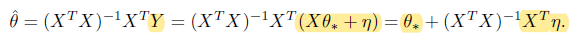

추정 파라미터와 실제 파라미터의 값의 차이는, 

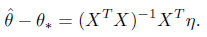

한 시점의 fixed arm choice를 $x\in{R^d}$로 나타내고, $w^T=x^T(X^TX)^{-1}X^T$로 나타내자 (and, t와 wt는 이미 값을 알고 있는 vector이다.). linear bandit에서 알고자하는 것은 linear coeff의 추정량과 실제 값의 차이인 구간이 어떻게 나타나는 지이다($x^T(\hat{\Theta}-\Theta_*)=x^T(X^TX)^{-1}X^T\eta=w^T\eta$). 이러한 bound를 계산하기 위한 절차를 2.1. 절의 방식을 활용하면 왜 stochastic bandit을 linear bandit에 적용할 수 없는지 알 수 있다. 

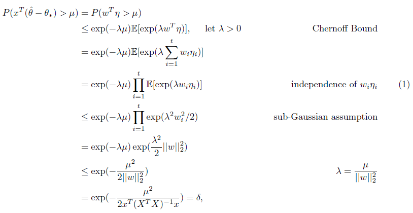

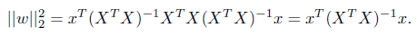

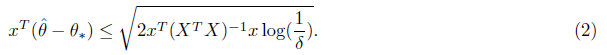

when stopping time is correlated with the process

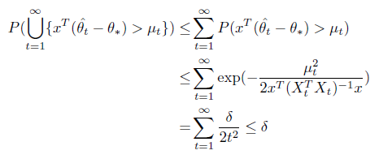

$\mu_t=\sqrt{2x^T(X_t^TX_t)^{-1}xlog(\frac{2t^2}{\delta})}$

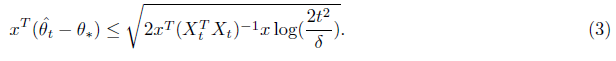

위의 수식들의 전개는 action이 game이 이미 시작한 경우, 즉 과거의 선택에 independent한 경우에는 올바르지만, linear bandit에서는 특정 시점의 action의 선택은 과거의 action의 선택과 reward의 집합에 영향을 받기 때문에 문제가 생긴다. 

$x_t$ depends on $\{x_i,t_i\}^{t-1}_{t=1}$

우선 전개 수식 중 dependent한 경우에는 (1)의 등식은 성립할 수 없다. 왜냐하면 $w_i\eta_i$가 독립적이지 않기 때문이다. 

그리고, (2) 수식에서는 수식이 dependence $\sqrt{d}$와 유사한 scale로 나타나야 하나 그러지 못하므로, 문제가 생긴다.
