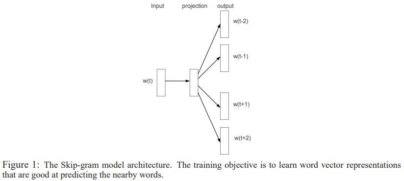
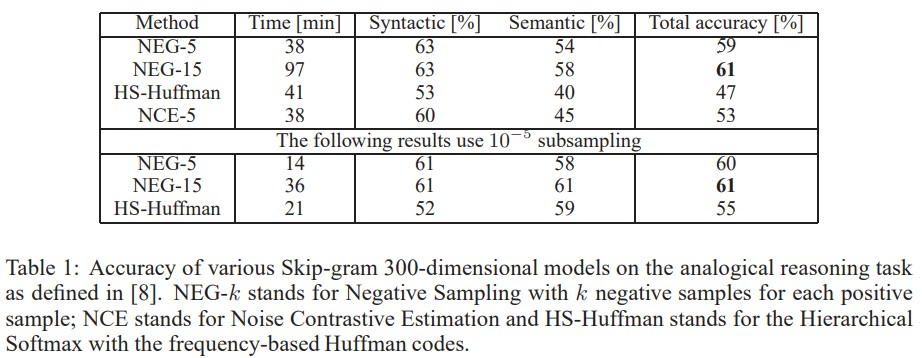
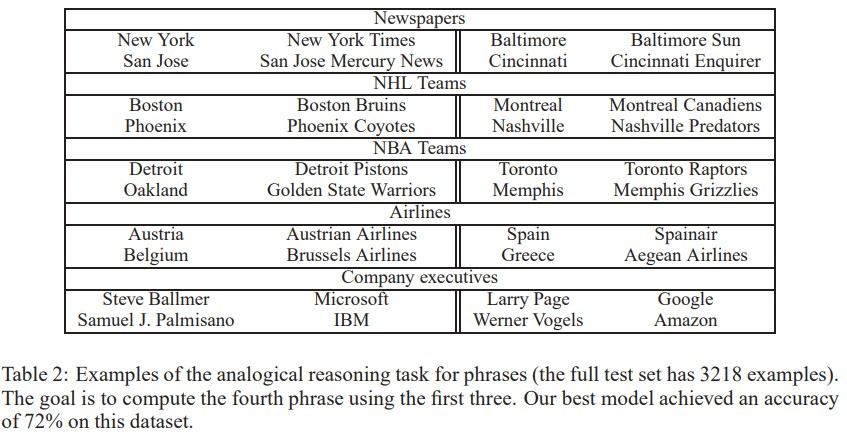

# Distributed Representations of Words and Phrases and their Compositionality

https://proceedings.neurips.cc/paper/2013/file/9aa42b31882ec039965f3c4923ce901b-Paper.pdf

https://jeongukjae.github.io/posts/3negative-sampling/

https://yunmap.tistory.com/entry/%EB%85%BC%EB%AC%B8-Distributed-Representations-of-Words-and-Phrases-and-their-Compositionality-Tomas-Mikolov

## Abstract

Skip-gram model이 많은 수의 단어에 대해 문법적 / 문맥적 관계를 고 수준의 vector 표현으로 정확하게 나타내는 것을 학습하는데 효과적인 방법임이 밝혀지고 있다. 이 Paper에서는 vector의 quality와 training speed를 증진시킬수 있는 방법에 대해 살펴보려고 한다. '자주 등장하는 단어에 대한 subsampling 방식'은 학습 속도와 일반화된 단어 조합을 학습하는데 성능이 좋았다. 그리고 negative sampling 방식으로 불리는 'hierachical softmax' 대안에 대해서도 살펴보자.

## Introduction

유사한 단어를 그루핑 하는 NLP에 있어서 벡터공간에 분산되게 표현하는 방식은 학습 알고리즘들이 더 나은 성능을 보이는데 기여하고 있다. 가장 처음으로 벡터로 표현하는 방식은 통계적인 언어 모델링을 하는 방식을 활용했다. 

그러나 최근에는 Skip-gram 방식이 소개되었고, 이는 더 많은 양의 비구조적인 텍스트 데이터를 벡터로 나타내는데 있어서 효과적인 방법으로 소개되고 있다. 기존에 소개된 학습 방법과는 달리 Skip-gram 방식은 'dense matrix mutiplication'방식을 사용하지 않는다. 이는 학습이 더 효율적으로 수행되도록 도왔다.

Neural Net을 활용하여 단어를 표현하는 것은 많은 언어적인 정규성이나 패턴들을 학습하는 것이 가능했기 때문에 흥미로운 방법이다.

해당 논문에서는 Skip-gram 모델의 몇가지 형태에 대해서 살펴본다. 

* 자주 등장하는 단어에 대한 subsampling 방식

  : 2배에서 10배 정도의 속도 상승 및 적게 등장하는 단어에 대한 정확도 상승

* Noise Contrastive Estimation

  : 학습의 속도 증가 및 자주 등장하는 단어에 대한 벡터화 정확도 상승 (hierachical softmax 방식과 비교 시,)

단어가 표현됨에 있어서 관용적으로 절대 묶이지 않는 문구가 있을 수 있다. e.g) "Boston Globe", Boston 지역의 신문회사. 이런 단어들은 Boston과 Globe로 나누지 않고 하나의 Phrase를 input으로 하는데, 이는 Skip-gram Model에서 발생하는 비용을 증가시킨다. 다른 방법으로는 recursive autoencoder를 활용하여 word vector들을 결합하여 문장을 만드는데, 여기에서는 word vector대신에 phrase vector를 활용하여 이점이 있었다.

Word Phrase를 이용한 방식은 상대적으로 간단하며, data 특성에 맞게 많은 phrase들로 쪼갠 후 토큰화하여 학습을 수행한다. 그리고, 마지막으로 도출한 vector들의 간단한 수학적인 연산으로 유의미한 결과를 나타냈다.

## The Skip-gram Model

Skip-gram의 objective는 단어나 문서에서 주변의 단어를 예측하는데 유용한 word representation을 찾는것이다. 다시 말하지면 $w_1,w_2,w_3,...,w_T$의 연속적인 단어를 학습하는 경우 Skip-gram model의 목적은 'average log probability'를 극대화 하는 것이다.

c는 training context의 size를 말하며, 크기가 클수록 많은 예제들이 학습에 사용되고 높은 정확도를 보이지만, 학습에 많은 시간이 소요된다.

$v_w$ and $v^\prime_w$은 입력 및 출력의 vector 표현값이며, W는 단어의 개수를 의미한다.

### 2.1. Hierarchical Softmax 

이는 full softmax에 비해 컴퓨팅적으로 봤을 때 효율적으로 추정하는 softmax 방식이다. 계층적인 방식이 기존 방식보다 좋은 이유는 output node W에 대해서 평가 진행시 $log_2(W)$개의 node만으로 평가를 수행할 수 있기 때문이다.

Hierarchical Softmax는 output layer에 W개이 단어 수 만큼 leaf가 존재하는 이진트리이먀, 자식노드들에 상대적인 확률이 할당되어 있다. 단어들에 확률은 random한 방식으로 정의된다.

다시 말하자면, 각각의 단어 w는 root에서부터 적절한 경로들이있다. $n(w,j)$ 이를 root에서 w로 향하는데 있어서 j번째 node라고 나타내고, $L(w)$는 경로의 길이를 나타내고, $n(w,1)$=root,  $n(w,L(w))=w$ 이다. $ch(n)$을 n 노드의 child라고 한다면, $[x]$를 x가 true이면 1, 아니면 -1이라고 하고 아래의 식을 살펴보자.

$\sigma(x)=1/(1+exp(-x))$이고, $\sum^W_{w=1}p(w|w_I)=1$이다. 이로 인해 $log\ p(w_O|w_I)$와$\triangledown{log\ p(W_O|W_I)}$의 cost 계산은 평균이 $log W$보다 크거나 같지 않은 $L(w_O)$의 비율로 나타낼 수 있다. 기본 Skip-gram 방식의 softmax 식과 달리 $v_w$와 $v^\prime_w$이 w로 매핑되었고 각각의 단어 w에 대해 $v_w$는 한번만 나타나고, 이진트리의 모든 내부노드 n에 대해 $v^\prime_n$이 한 번 나타난다.

이러한 트리 구조는 hierarchical softmax 방식이 성능면에서 상당한 효과가 있음을 보였다. 이진 허프만 트리로 자주 등장하는 단어를 짧은 code로 할당하여 훈련을 수행했다. 

### 2.2. Negative Sampling

hierarchical softmax의 대안은 Noise Contrastive Estimation(NCE)이다. NCE는 logistic regression의 평균에 의해 noise를 구분하는 모델이다. 

NCE가 softmax의 log probabiliy 최대화 값을 추정하는데 보이는 반면, Skip-gram은 벡터 표현에 있어서 높은 quality를 지향하는 것만 고려하여 학습한다. 그래서 NCE를 벡터 표현시 quailty만을 추구하게 끔 간단화 하는것을 Negative Sampling(NEG)라고 정의한다. NEG의 objective는 Skip-gram에서 모든 $log\ P(w_O|w_I)$의 식을 바꾸는 것이다.   

따라서, 이는 각 데이터 샘플에서 k개의 negative sample이 있는 noise distribution $P_n(W)$에서 logistic regression을 사용하여 목표 단어 $W_O$를 구분하는 것이다. k는 작은 데이터셋에서는 5~20을 지정하고 큰 데이터셋에서는 2~5로 값을 설정한다. NEG와 NCE의 주된 차이점은 NCE는 샘플과 numerical probabilities의 noise distribution을 필요로 하는 반면에 NEG는 샘플의 noise distribution만을 필요로 하기 때문이다. 

### 2.3. Subsampling of Frequent Words

서로 자주 등장하는 단어들을 잘 포착하여 학습하는 Skip gram방식과 비교했을때 위의 방법은 서로 적게 등장하는 단어 조합에 대하여 효과가 있다. 이는 자주 등장하는 벡터의 표현은 몇백만번의 학습 이후에도 바뀌지 않을 것이라는 반대 방향으로 적용된 아이디어를 적용하는 방식이다.

적게 등장하고 많이 등장하는 단어 간의 불균형을 세기 위해, 간단한 subsampling 방식을 활용한다.

$f(w_i)$는 단어 $w_i$이 빈도,  $t$는 선택된 시점.

## 3. Empirical Results

## 4. Learning Phrases

같이 등장하는 phrase를 찾기 위한 수식은 아래와 같다.

