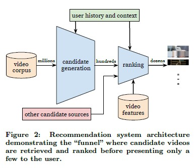
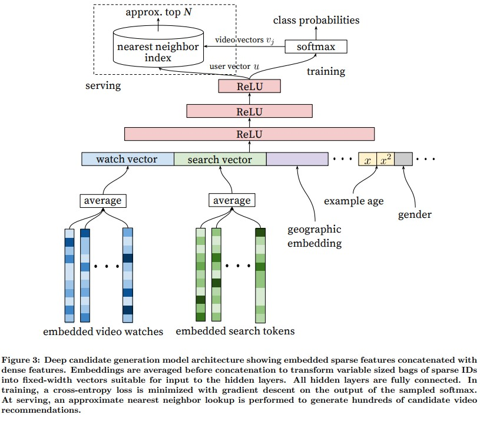

# Deep Neural Networks for YouTube Recommendations

논문: https://static.googleusercontent.com/media/research.google.com/en//pubs/archive/45530.pdf

참고자료: https://yamalab.tistory.com/124?category=747907

## 주요 도전과제

* Scale

  : Youtube는 매 초마다 엄청난 양과 길이의 영상이 upload된다. 그리고, 그 양만큼 엄청난 수의 사용자들이 존재한다. 그렇기 때문에 엄청난 양의 실시간 영상을 사용자들에게 추천하는데 있어서 Scalability는 주요한 도전과제 중 하나이다.

* Freshness

  : 이는 Scale의 도전과제와 일부 일맥 상통한다. 매초 수많은 새로운 영상들이 올라오기 떄문에, 새로운 영상을 추천하는 것 또한 중요하다. 그리고 새로운 영상 뿐 아니라 기존의 영상과의 추천의 Balance 또한 중요하다.

* Noise

  : Youtube 사용자들의 정보들은 sparsity함이 크고 측정할 수 없는 다양한 외부요인들이 있다. 이는 추천을 함에있어 Noise로 작용한다. 따라서 추천 시스템은 이러한 데이터적인 특징을 고려하여 robust한 모델이 필요하다.

## DNN 모델 개요

모델은 크게 'candidate generation'과 'ranking'을 위한 형태 두가지로 구성된다. 

'candidate generation'부에서는 video 정보를 입력으로 하여 수백정도의 후보들을 도출한다. 이는 특정 유저와 가장 연관있는 상위의 영상들만을 추출하기 위함이다. 해당 Neural Net은 Collaborative Filtering과 같이  [시청한 Video ID, 검색 기록, 개인 사용자 정보(e.g) 성별, 나이, 지역 등등..] 을 concat한 vector를 input으로 하여 유사한 상위 k% 의 video를 반환한다.

'ranking'부에서는 각각의 Video에 대해서 방대한 Video와 User들의 feature를 사용한 objective function을 사용하여  점수를 부여하고 이를 활용하여 rank를 매긴다.

#### 왜 candidate와 ranking으로 분리할까요?

candidate를 하는 이유는 추천의 대상은 엄청 크지만 사용자에게 나타나야 하는 영상의 수는 이에 비해 훨씬 작기 때문입니다. 그래서 대상을 극 소수로 줄임으로써 효율성을 도모합니다.

## Candidate Generation Model

해당 논문에서는 Recommendation의 문제 정의를 highly extreme muti-class classification으로 정의합니다.

$P(w_t =i|U,C)={e^{v_{i}u}}/{\sum_{j\in{V}}e^{v_j{u}}}$

사용자 U와 Context C에 대하여 t시점에 i 영상을 보는 확률은, 사용자가 모든 영상을 감상하는 것 중에 해당 영상을 모두 시청하는 것을 나타내는 확률인 softmax 함수로 도출된다.

Youtube는 다양한 explicit / implicit feedback을 가지고 있지만, 왜 '해당 영상을 끝까지 시청하는' implicit한 feedback을 활용하여 확률 및 함수를 구성하였는가? 

좋아요과 같은 explicit feedback은 영상 추천에 있어서 급상승하는 영상등의 불확실한 상황에 dependent할 수 있기 때문이다.

#### Efficient Learning

1. Softmax 함수 관련

해당 논문에서 문제를 highly extreme mutli-class classification로 정의했다. 따라서 Softmax Classification을 수행한다. 그러나 다중 분류에서 class의 수가 늘어나게되면 가능한 모든 클래스에 대해 내적을 수행하기 떄문에 계산량이 기하급수적으로 증가한다. 

따라서, 이 논문에서는 이러한 문제점을 word2vec에서 negative sampling하는 것과 비슷한 방식으로 해결한다. negative sample이 많은 경우에는 전통적인 softmax 방식보다 빠른 속도를 보였다고 한다.

* About negative sampling

  https://www.sallys.space/blog/2018/04/05/negative-sampling/

2. Serving Time

Generation Model에서 input으로 수백의 video들에 대한 vector가 input되지만 적절한 시간 내로 return하려면 어떻게 해야하는가? 논문에서는 K nearest neighbor 방식을 활용하여 Time을 맞출 수 있었다고 한다.

#### Model Architecture

Model에서는 추천을 위해 시청기록, 검색기록, 사용자 정보(나이, 성별, 거주지 등등), 영상 정보를 input으로 하여 여러개의 은닉층으로 구성된 DNN을 사용한다.

시청기록과 검색기록은 각 기록들에 대해서 Video ID와 검색 string을 Embedding한 결과를 Average하여 사용한다. 여기서 Average를 적용하는 이유는 가장 최근에 시청한 영상과 검색한 기록에 의존적으로 Model이 추천하지 않도록 하기 위함이다. 이를 통해 시간적이거나 sequence 적인 정보는 희석된다.