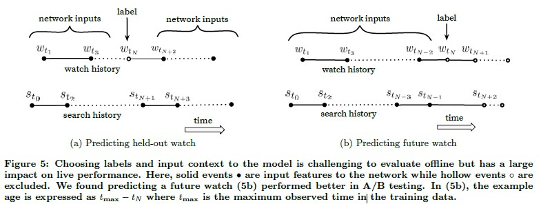
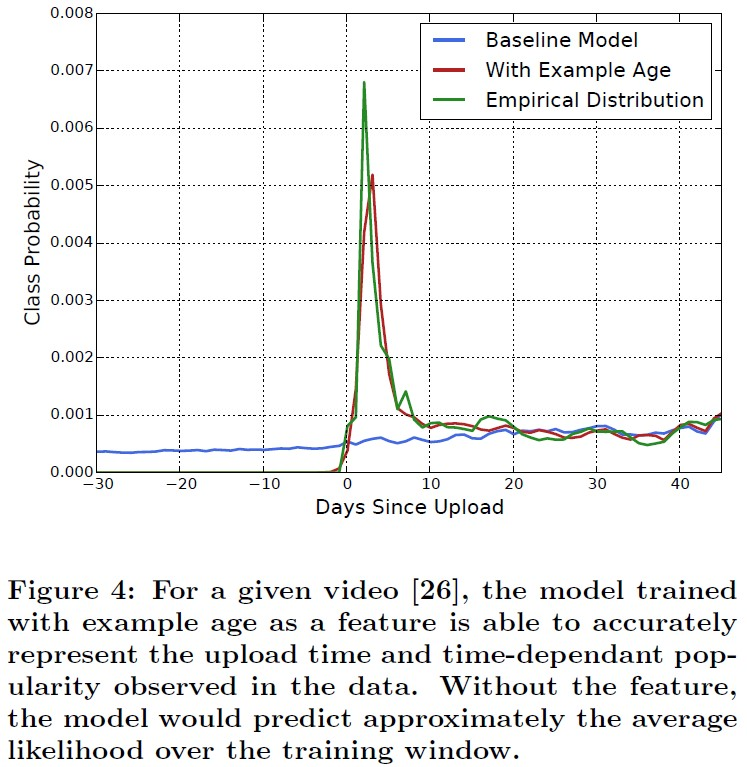
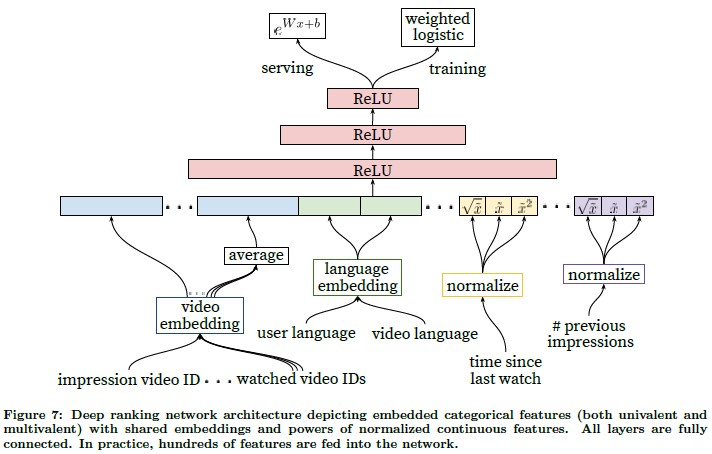

# Deep Neural Networks for YouTube Recommendations

논문: https://static.googleusercontent.com/media/research.google.com/en//pubs/archive/45530.pdf

참고자료

https://yamalab.tistory.com/124?category=747907

http://keunwoochoi.blogspot.com/2016/09/deep-neural-networks-for-youtube.html

https://www.youtube.com/watch?v=V6zixdCIOqw

## 주요 도전과제

* Scale

  : Youtube는 매 초마다 엄청난 양과 길이의 영상이 upload된다. 그리고, 그 양만큼 엄청난 수의 사용자들이 존재한다. 그렇기 때문에 엄청난 양의 실시간 영상을 사용자들에게 추천하는데 있어서 Scalability는 주요한 도전과제 중 하나이다.

* Freshness

  : 이는 Scale의 도전과제와 일부 일맥 상통한다. 매초 수많은 새로운 영상들이 올라오기 떄문에, 새로운 영상을 추천하는 것 또한 중요하다. 그리고 새로운 영상 뿐 아니라 기존의 영상과의 추천의 Balance 또한 중요하다.

* Noise

  : Youtube 사용자들의 정보들은 sparsity함이 크고 측정할 수 없는 다양한 외부요인들이 있다. 이는 추천을 함에있어 Noise로 작용한다. 따라서 추천 시스템은 이러한 데이터적인 특징을 고려하여 robust한 모델이 필요하다.

## DNN 모델 개요

모델은 크게 'candidate generation'과 'ranking'을 위한 형태 두가지로 구성된다. 

'candidate generation'부에서는 video 정보를 입력으로 하여 수백정도의 후보들을 도출한다. 이는 특정 유저와 가장 연관있는 상위의 영상들만을 추출하기 위함이다. 해당 Neural Net은 Collaborative Filtering과 같이  [시청한 Video ID, 검색 기록, 개인 사용자 정보(e.g) 성별, 나이, 지역 등등..] 을 concat한 vector를 input으로 하여 유사한 상위 k% 의 video를 반환한다.

'ranking'부에서는 각각의 Video에 대해서 방대한 Video와 User들의 feature를 사용한 objective function을 사용하여  점수를 부여하고 이를 활용하여 rank를 매긴다.

#### 왜 candidate와 ranking으로 분리할까요?

candidate를 하는 이유는 추천의 대상은 엄청 크지만 사용자에게 나타나야 하는 영상의 수는 이에 비해 훨씬 작기 때문입니다. 그래서 대상을 극 소수로 줄임으로써 효율성을 도모합니다.

## Candidate Generation Model

해당 논문에서는 Recommendation의 문제 정의를 highly extreme muti-class classification으로 정의합니다.

사용자 U와 Context C에 대하여 t시점에 i 영상을 보는 확률은, 사용자가 모든 영상을 감상하는 것 중에 해당 영상을 모두 시청하는 것을 나타내는 확률인 softmax 함수로 도출된다.

Youtube는 다양한 explicit / implicit feedback을 가지고 있지만, 왜 '해당 영상을 끝까지 시청하는' implicit한 feedback을 활용하여 확률 및 함수를 구성하였는가? 

좋아요과 같은 explicit feedback은 영상 추천에 있어서 급상승하는 영상등의 불확실한 상황에 dependent할 수 있기 때문이다.

#### Efficient Learning

1. Softmax 함수 관련

해당 논문에서 문제를 highly extreme mutli-class classification로 정의했다. 따라서 Softmax Classification을 수행한다. 그러나 다중 분류에서 class의 수가 늘어나게되면 가능한 모든 클래스에 대해 내적을 수행하기 떄문에 계산량이 기하급수적으로 증가한다. 

따라서, 이 논문에서는 이러한 문제점을 word2vec에서 negative sampling하는 것과 비슷한 방식으로 해결한다. negative sample이 많은 경우에는 전통적인 softmax 방식보다 빠른 속도를 보였다고 한다.

* About negative sampling

  https://www.sallys.space/blog/2018/04/05/negative-sampling/

2. Serving Time

Generation Model에서 input으로 수백의 video들에 대한 vector가 input되지만 적절한 시간 내로 return하려면 어떻게 해야하는가? 논문에서는 K nearest neighbor 방식을 활용하여 Time을 맞출 수 있었다고 한다.

#### Model Architecture

Model에서는 추천을 위해 시청기록, 검색기록, 사용자 정보(나이, 성별, 거주지 등등), 영상 정보를 input으로 하여 여러개의 은닉층으로 구성된 DNN을 사용한다. 위의 모델을 거쳐 나오는 output은 하나의 user embedding으로 간주한다.

시청기록과 검색기록은 각 기록들에 대해서 Video ID와 검색 string을 Embedding한 결과를 Average하여 사용한다. 여기서 Average를 적용하는 이유는 가장 최근에 시청한 영상과 검색한 기록에 의존적으로 Model이 추천하지 않도록 하기 위함이다(e.g. Talyor Swift). 이를 통해 시간적이거나 sequence 적인 정보는 희석된다.

영상에 대한 정보는 Youtube에서 재생되는 영상 뿐 아니라 웹페이지에 import되어 재생되는 영상을 모두 포함했다. 이는 이미 Youtube에서 재생된 영상들은 기존 시스템의 영향을 받을 수 있기 때문이다. 

그리고, 각 사용자에 대한 영상 시청 정보는 heavy-user에 치우치지 않기 위해서 일정 개수를 제한하여 샘플링하였다. 왜냐하면 특정 사용자가 특정 시점에 많은 양의 영상을 시청할 수 있기 때문이다. 

그리고 video에 대해서 video_id나 search history를 샘플링하는데 있어서 (b)의 그림과 같이 과거의 history를 담을 수 있도록 샘플링하였다[<-> 일반적인 collaborative filitering문제가 random하게 샘플링하는것 에 비해(a)]. 이는 일반적인 영상 소비 패턴의 경우 t-1과 t-2에 소비한 영상은 서로 연관성이 낮지만, 특정 Youtuber 및 가수의 영상등을 시청하는 경우 선후관계에 연관성이 높을 것이기 때문이다.

그리고 영상과 관련된 정보외에도 사용자의 정보를 input vector로 활용한다. 이 값들은 모두 0에서 1사이로 정규화된 값으로 투입된다. 

user embedding으로 출력한 vector를 softmax함수를 통하여 수백만개의 video에 대한 추천 형태로 반환된다. user embedding을 학습하기 위해서 negative sampling 방식을 활용하여 샘플링한 벡터로 학습을 수행. (softmax를 통한 학습법보다 성능이 좋았음.)

Serving은 학습된 user vector와 softmax를 통해 얻어낸 video vector를 활용한다. 이 두 vector를 Dot-product space에서 가장 가까운 아이템을 찾는다. 이 방식을 Nearest Neighbor 방식과 비교하였을 때 성능간의 차이는 발생하지 않았지만 반응속도가 중요하기 때문에 dot-product 방식을 활용했다.

#### Consistent Feature Selection Process

* Example age ($t_{max} - t_N$ in Figure 5.)

  : 위의 설계한 모델을 실제 운영상황에 도입해보았을 때, 이상적으로 생각한 것들과 많이 달랐다. 그래서 지속적으로 model의 input으로 들어가는 vector에 다양한 특성들을 투입하는 프로세스를 거쳤다. 그 중 '영상의 나이'를 뜻하는 Example Age를 살펴보자. 
  
   실제 영상을 경험적으로 살펴보면 초록색 그래프와 같이 최신 영상일 수록 선택될 확률이 높다. 그러나 이 특성을 반영하기 전에는 위의 특징을 반영할 수 없었다. 영상의 나이라는 특성을 반영한 이후로 경험적으로 살펴본 추세와 동일하게 영상을 추천하게 되었다.

## Ranking Model

Ranking Model은 Candidate Generation Model을 활용해 생성한 후보군들을 사용자의 감정데이터를 활용하여 user interface에 맞게 추려주는 역할을 하는 모델이다. Ranking Model에서는 Weighted Logistic Regression을 활용하여 video들에 대한 개별적인 score를 할당한다. 따라서 이 스코어를 기준으로 정렬하여 인터페이스에 맞는 top n개의 video를 추천하는 것이다.

Ranking Model에서 input으로 투입되는 video는 Candidate Model과 달리 직전 시청 video, 시청했지만 interaction하지 않은 video등을 input으로 사용한다. 이는 Ranking을 매기는데 있어서 이전의 historical한 정보를 활용함으로써 더 강력한 성능을 보여주기 떄문이다. 이런 강력한 성능을 보여주는 vector는 그대로 input하고 나머지 video는 이전과 동일하게 average등을 통해 투입한다. 

ranking에 대한 objective fucntion에서는 CTR(Click-Through Rate)를 사용하지 않고 시청한 시간을 활용하였다. 왜냐하면, CTR의 경우에는 유저가 원치 않는 광고성 video가 포함될 수 있기 때문에 더 확실한 시청 시간을 기준으로 function을 구축하였다.

* categorical features: 대부분 기수성이 높은 데이터들이지만, binary 성 데이터도 있음.
* continuous / oridinal features 
* univalent / multivalent: uni. impresson이 측정된 Video_id, multi. 사용자가 시정한 Video_id

#### Feature Enginnering

딥러닝모델을 활용하였지만 각 feature들을 어떻게 가공하고 활용하는지가 중요했다.

가장 중요했던 feature는 다른 유사한 video에서 보였던 사용자의 상호작용이었다.

e.g. 특정 채널에서 얼마나 많은 영상을 보았는지? 해당 토픽의 영상을 마지막으로 본 시점이 언제인지?...

그리고 candidate model에서 넘어온 candidate video의 점수 또한 중요하게 작용했다.

마지막으로 특정 사용자에게 추천된 영상을 보지 않는 경우에는 해당 영상의 우선순위를 강등하는 방식을 도입했다.

#### Modeling Expected Watch Time

Ranking Model을 통해 예측하고자하는 값은 'expected watch time'이다. 이를 위해서 앞서 언급한 weighted logistic regression을 활용한다. Model은 Cross Entrophy Loss를 활용하여 Logistic Regression을 수행한다.

Positive Impression과 Negative Impression에 의해 다른 가중치를 받게 된다.

N: the number of traning sample, k: the number of positive impressions, $T_i$: watch time of the ith impression