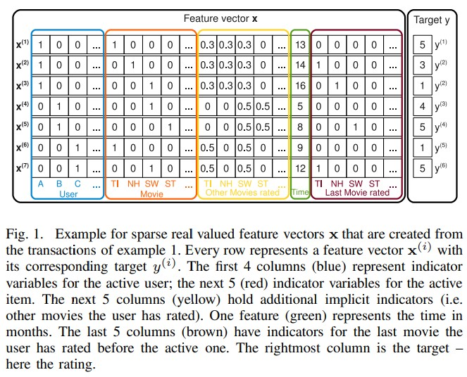
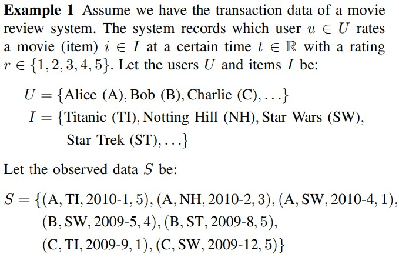
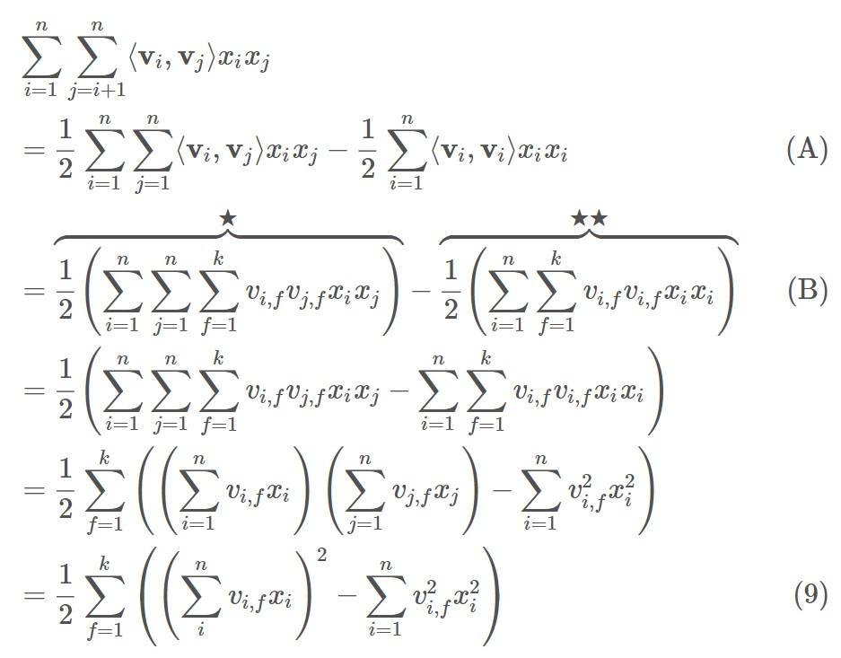
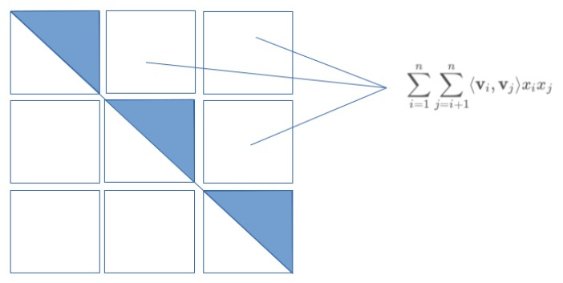
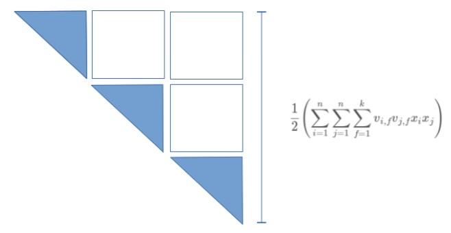
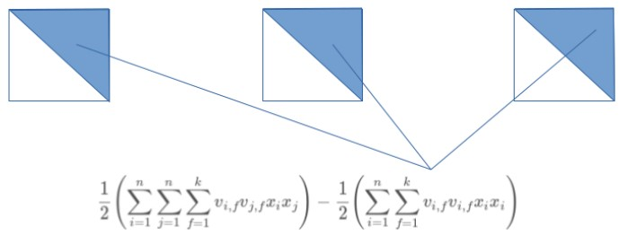

# Factorization Machines

https://www.csie.ntu.edu.tw/~b97053/paper/Rendle2010FM.pdf

## References

* concept of FM

  https://www.jefkine.com/recsys/2017/03/27/factorization-machines/

* etc references

  https://yamalab.tistory.com/107

  https://yamalab.tistory.com/128?category=747907

  https://greeksharifa.github.io/machine_learning/2019/12/21/FM/

* Packages

  https://github.com/rixwew/pytorch-fm

  https://github.com/jmhessel/fmpytorch

  https://www.kaggle.com/gennadylaptev/factorization-machine-implemented-in-pytorch

## 1. Introduction

 FM(Factorization Machine)은 SVM과 같은 예측모델이지만 높은 희소행렬 환경에서도 신뢰할 만한 추정이 이루어지는 모델이다. FM은 선형적인 시간복잡도로 수행이 되며, 이로 인해 직접적인 최적화 및 모델 파라미터 저장 시 SVM과 달리 그에 수반되는 데이터를 저장할 필요가 없다. 

FM의 장점

1. SVM이 실패하는 엄청 희소한 데이터에 대해서도 parameter 추정이 가능
2. 선형적인 복잡성으로 support vector들에 의존이 필요없이 최적화 수행이 가능하고, 엄청난 양이 데이터셋에도 훈련이 가능하다.
3. 어떤 실제 값을 가진 feature vector에도 예측을 수행할 수 있다.

## 2. Prediction under Sparsity

목표는 $y: R^n \rightarrow T$를 충족하는 function을 추정 $x\in{R^n}; T:Target\ Domain(classification\ or\ regression)$

Training Dataset: $D = {(x^{(1)},y^{(1)}),(x^{(2)},y^{(2)}),...}$

function을 통해 도출한 점수 값을 정렬함으로써  ranking task에도 사용할 수 있다.

scoring function은 $(X^{(A)},X^{(B)})\in{D}$ 에서, $X^{(A)}$는 $X^{(B)}$보다 높은 rank에 있다는 것을 가정해서 pairwise training data<a href="https://www.cs.cornell.edu/people/tj/publications/joachims_02c.pdf">[5]</a> 를 통해 학습할 수 있다.  pairwise ranking relation은 비정상적이라 positive training instance 만을 대상으로 수행한다.

위의 그림은 논문에서 다루게되는 데이터를 나타낸 도식이다. 앞서 설명한 것과 같이 데이터는 high sparsity한 형태를 가지고 있다. 그리고 논문에서 언급하는 Example 1에서 나타나는 데이터는 Fig1.에서 하나의 row마다 표현되어 있다.

## 3. Factorization Machines (FM)

### A. Factorization Machine Model

1. Model Equation

   factorization machine에서 사용하려는 feature의 degree, d=2인 경우의 식은 아래와 같다.

   $\hat{y}(x):=w_0+\overset{n}{\underset{i=1}{\sum}}w_ix_i+\overset{n}{\underset{i=1}{\sum}}\overset{n}{\underset{j=i+1}{\sum}}<v_i,v_j>x_ix_j$

   $w_0\in{R},\ w\in{R^n},\ V\in{R^{n\times{k}}}$

   $<*,*>$ 는 k크기의 두벡터를 내적한 것과 같다.

   $<v_i,v_j>:=\overset{k}{\underset{f=i}{\sum}}v_{i,f}*v_{j,f}$

   V벡터 내에서 $v_i$는 k개의 factor로 나타낸 i번째 변수를 말한다.

   $k\in{N_0^+}$는 factorization을 수행할 차원을 정의하는 hyper parameter를 말한다.

   * $w_0$는 global bias

   * $w_i$는 i 번째 변수의 strength
   * $\hat{w}_{i,j}:=<V_i,V_j>$ i번째 변수와 j번째 변수의 상관관계를 모델링한다.

2. Expressiveness

   positive definite matrix $W$, k값이 충분히 크게되면 우측의 식을 만족하고 어떤 FM이건 interaction Matrix $W$를 나타낼 수 있다. $W=V*V^t$ . 그럼에도 불구하고, 복잡한 interaction W를 추정하기에 적절한 데이터가 없어 k를 작은 값으로 설정한다. 그리고 k를 제한하는 것은 FM의 비용때문이며 이는 일반성을 높여준다.

3. Parameter Estimation Under Sparsity

   FM은 feature간의 상호관계를 잘 추정할 수 있다. 왜냐하면, factorizing 함으로써 독립성을 허물기 때문이다. 

   e.g) Alice와 Star Trek 간의 interaction

4. Computation

   직관적인 시간복잡도는 $O(Kn^2)$. 왜냐하면, 모든 pairwise interaction이 계산되어야 하기 때문이다. 그러나 식을 재구축하게 되면 linear한 시간복잡도를 얻을 수 있다.

   $\hat{y}(x):=w_0+\overset{n}{\underset{i=1}{\sum}}w_ix_i+\overset{n}{\underset{i=1}{\sum}}\overset{n}{\underset{j=i+1}{\sum}}<v_i,v_j>x_ix_j$

   $<v_i,v_j>:=\overset{k}{\underset{f=i}{\sum}}v_{i,f}*v_{j,f}$

   

   
   

   positive semi-definite matrix $W=VV^T$는 대칭적인 pairwise feature interaction의 가중치를 가지고 있다. 대칭성(divided by 2) 때문에 다른 모든 pair들을 더하는 것은 모든 pair를 더하는 것에 자기자신을 더한것을 빼는 것과 동일하다. 따라서 A의 수식이 등장.

   

   * **linear equation Figure1.**

   

   
   

   * **linear equation Figure2.**

   

   
   

   * **linear equation Figure3.**

   

   
   

   위의 절차를 통해 각 feature들 간의 interaction만을 담은 9번식을 가지고 아래의 전체 식이 도출된다.

   $\hat{y}(x)=w_0+\overset{n}{\underset{i=1}{\sum}}w_ix_i+\frac{1}{2}\overset{k}{\underset{f=1}{\sum}}((\overset{n}{\underset{i}{\sum}}v_{i,j}x_i)^2-\overset{n}{\underset{i=1}{\sum}}v^2_{i,f}x^2_i)$

   그리고 x의 대부분의 인자값은 0이라서 non-zero element들에 대해서만 sum이 일어남으로 시간복잡도는 $O(k\bar{m}_D)$라고도 추정할 수 있다.

5. Summary

   FM 모델은 feature vector의 값과 factorized interaction 값을 활용하여 모든 가능한 interaction들을 표현한다. 이는 두가지 이점이 있다.

   1) 더 큰 sparsity한 특징을 가진 상관관계도 나타낼 수 있다. 특히 관측되지 않은 상관관계에 대해 일반화가 가능하다.

   2) 파라미터의 수나 시간이 선형적인 복잡도를 가진다. 이 때문에 최적화시 SGD를 사용할 수 있으며, 다양한 loss function을 채택할 수 있다.