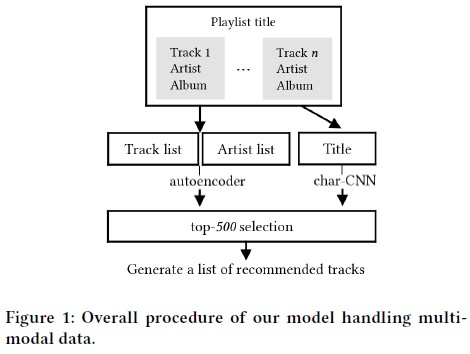
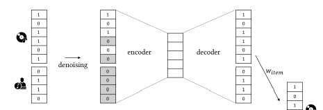
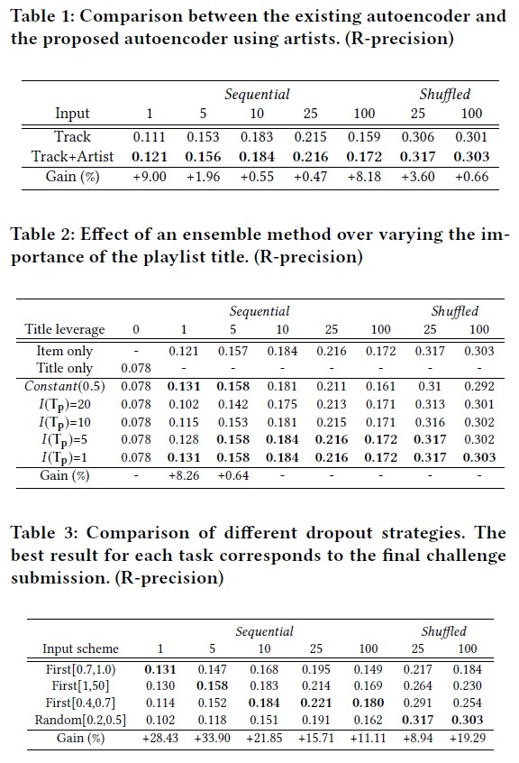

# MMCF: Multimodal Collaborative Filtering for Automatic Playlist Continuation

## paper link
<a href="https://dl.acm.org/doi/10.1145/3267471.3267482">https://dl.acm.org/doi/10.1145/3267471.3267482</a>

## github repo
<a href="https://github.com/hojinYang/spotify_recSys_challenge_2018">https://github.com/hojinYang/spotify_recSys_challenge_2018</a>

## Abstract
Automatic playlist continuation(APC)는 음악 추천시스템의 기본적인 task이다. 사용자에게 특정 track으로 구성된 리스트를 playlist에 산재하는 특징을 반영하여 추천하는 것이다.

그러나 이러한 추천시스템은 여러 문제점을 가지고 있다(via Collaborative Filtering; CF).

1. 'popularity bias': 플레이리스트에 적게 등장하는 노래를 추천하지 못하는 문제

2. 'cold-start problem': 엄청 적은 수의 트랙만을 가지고 있는 플레이리스트를 활용하지 못하는 문제

3. 'context-aware continuation': track의 순서나 playlist title과 같은 context한 정보를 무시하는 문제

해당 논문에서는 다양한 데이터를 효과적으로 이용하기 위해 'multimodal collaborative filtering' 모델을 제안한다. 이는 크게 두개의 요소로 구성된다.

1. playlist와 categorical content를 사용하는 autoencoder

2. playlist title만들 사용한 character-level convoultional neural network

playlist와 context한 정보를 동시에 다룸으로써, 'popularity bias'와 'cold-start problem'에 대처하ㄹ수 있으며, playlist의 title값을 활용하여 더 잘 들어맞는 track을 추천할 수 있게 되었다.

## 1. Introduction

Abstract에서 언급된 자주 활용되는 CF 기반의 APC가 3가지 문제에 마주한다. 따라서 'multimodal collaborative filtering' 방식을 제안한다.

이 중 하나는 playlist와 categorical한 contents를 input으로 하는 <a href="https://arxiv.org/pdf/1704.04232.pdf">'hide-and-seek apporach'</a>에서 영감을 받은 autoencoder이다. 학습을 수행함에 있어 playlist나 contents 중에 하나를 무시한다. 더 나아가, playlist의 순서를 학습하기 위해 'two dropout' 전략들을 제안한다. 이를 통해서 playlist간의 복잡한 패턴 뿐만아니라 playlist에 순서에 있어서 hidden context를 학습할 수 있었다.

두 번째로는 'character-level convolutional neural network(charCNN)'이다. 이는 playlist와 playlist title간의 잠재 관계를 학습한다.

그리고 마지막으로, 두 모델의 앙상블을 위한 method를 보인다.

## 2. Preliminaries
### 2.3. Baseline Models
#### **Autoencoders**
AE(Autoencoder)는 비선형의 방식으로 데이터를 압축하여 표현하는 것과 임의의 결과값을 생성하는데 효과적인 모델이다. 최근 CF에 많이 사용되고 있으며, encoding부과 decoding부로 구성된다. 

입력부에는 은닉층으로 인해 압축되고 이를 다시 출력층으로 복원한다. 은닉층으로 인해 압축되면서 데이터를 임의의 잠재요인으로 표현한다.

* Encoder

    

* Decoder

    

따라서, Encoder와 Decoder를 지난 input x를 )})로 표현할 수 있다.

##### **loss function**

Autoencoder가 playlist에 대해 학습하는 것은 효과적이지만, 다른 context data를 학습하는데 한계가 있어 'Context-Aware Autoencoder'를 통해 한계를 극복하려고 한다.

#### **Character-level convolutional neural network**

CNN(convolutional neural network)는 이미지 및 영상 인식에서 많이 사용된다. CNN이 가지고 있는 텍스트의 지역성을 인지할 수 있는 능력 덕분에 텍스트 분류에도 사용되어 왔다.

CNN은 구조적으로 local feature 생성을 위한 convolution layer와 subsampling을 통해 정밀한 표현을 나타내는 pooling layer로 구성되어진다. 

filter는 windows size s에 대해 로 표현할 수 있다. 그리고, 텍스트 T의 순서에 convolutional 하게 모델을 나타낼 수 있다.

})는 i부터 i+s-1까지의 subsequence이고, b는 F의 bias이다. h는 활성화 함수이다.

small f는 Filter를 거쳐 얻은 feature vector이며, 1부터 t-s+1까지의 변수를 가진다.

## 3. Multimodal Collaborative Filtering(MMCF)

해당 논문의 MMCF 모델의 전반적인 형태는 아래와 같다.

앞서 언급했던것과 같이 하나는 Playlist에 속하는 track과 그 track의 context한 정보 artist값을 input으로 하는 autoencoder이며, 나마지는 playlist title로 playlist의 context한 정보를 포착하는 charCNN 모델이다.

마지막으로는 이둘을 결합하는 모델을 통해 top N개의 결과값을 return한다.

### 3.1. Context-Award Autoencoders

context 값을 활용하기 위한 기존의 접근으로는 <a href="https://alicezheng.org/papers/wsdm16-cdae.pdf">CDAE(Collaborative Denoising AutoEncoder)</a>와 <a href="https://static.googleusercontent.com/media/research.google.com/en//pubs/archive/45530.pdf">DeepWide</a> 방식이 있다. 이들에서 착안한 방식으로 input vector로 각각의 track과 artist의 정보를 concatenate하기로 했다.

그러나, 이는 playlist의 track에 대한 정보만 reconstruct하려고 하고, context한 정보는 무시되어 결과적으로 'popularity bias'와 'cold-start problem'에 대처하기에는 어려웠다.

Context-Aware Autoencoder

where, }},W^{\prime}\in{R^{d\times(n+k)}},b\in{R^d},b^{\prime}\in{R^{n+k}}})

#### **Training**

1. playlist track 포함 여부

    앞서 언급한 input data의 일부를 랜덤하게 0으로 masking하는 'hide-and-seek' 접근법을 활용하여 학습을 수행한다.

    임의로 playlist 또는 artist를 선택한다. 그리고 선택된 데이터에 대해 모든 feature vector의 값을 0으로 비활성화한다. 이로 인해 학습중에 둘 중 하나의 특성은 무시된다. 이로 인해, playlist와 content 만의 그리고 둘 간의 정보를 학습할 수 있다.

    다음으로, 일반화를 위해 둘 중 선택되지 않은 non-zero vector에 대해서도 임의로 0값을 만들어준다.

    * Setting the artist as 0

        

    * Setting the playlist as 0

        

    'hide-and-seek'아이디어는 두가지 효과가 있다.

    1. playlist-artist pair중 하나를 0로 함으로써, 교차하여 각 벡터에 대해서 학습할 수 있다.

    2. dropout 방식은 일반화하는데 좋은 방법이며, 이로 인해 다른 별다른 정규화과정이 필요하지 않았다.

2. playlist의 순서

    해당 데이터셋에서 사용자들은 Sequential하게 또는 Shuffle한 형태로 음악을 듣는데, 이를 반영하기 위해 타입별로 다른 전략을 세운다.

    * Sequential List: dropout하는데 있어서 상위 K개의 tack에 대해서만 수행한다. 

    * Shuffled List: random하게 dropout 대상 track을 지정한다.

마지막으로는 특정 playlist에 특정 track이 있는지 없는지를 구분하는 문제가 되며, 이는 'one-class collaborative filtering' problem(**observed** or **missing**)이다. 이를 위해 loss function으로 uniform weighted scheme를 사용한다.

### 3.2.CharCNN for Playlist Titles
CNN의 단위를 Character 단위로 하게된 이유
1. playlist title을 단어 단위로 하게 되면, out-of-dict 문제를 대처할 수 있다
2. charCNN이 RNN보다 텍스트의 지역적인 특성을 포착하는데 더 용이하다.

### 3.3. Combining Two Models

각 모델의 가중치를  같이 정의하고, 이들을 어떻게 정의하는지에 따라서 모델의 앙상블 정도를 결정한다.

위와 같이 설정하는 이유는, Autoencoder 모델이, 투입하는 input값의 개수에 따라서 정확도가 높아지기 때문에 이를 반영하여 위의 수식과 같이 각각의 가중치를 결정한다.

## 4. Experiment

Overall Experiment Result

