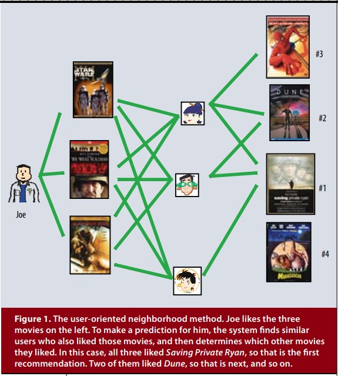
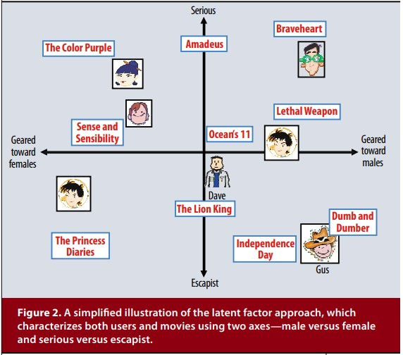

# Matrix Factorization Techniques for Recommender Systems

## paper

<a href="https://www.inf.unibz.it/~ricci/ISR/papers/ieeecomputer.pdf">https://www.inf.unibz.it/~ricci/ISR/papers/ieeecomputer.pdf</a>

## Recommender System Strategies

* Content Filitering 

    user나 product에 대해 profile을 생성하고 이를 활용하는 접근법.
    
    i.e. movie profile: 장르, 영화배우, box office 순위 / user profile: 인류학적인 정보 및 질문에 대한 답변

    위와 같은 profile로 적절한 product를 매핑하는 것이다.

    successful case: 'Music Genome Project'

* Collaborative Filtering

    과거 사용자의 행동을 활용하여 추천에 활용하는 접근법. 새로운 사용자-아이템 관계를 예측하기 위해 기존 사용자와 대상간의 상호의존성 관계를 분석하여 활용하는 방법

    이는 'domain-free'한 장점을 가지고 있으며, content-based filtering에서 profile을 생성할 수 없는 경우에 활용되었다. contents-based 방식보다 성능이 좋은 반면에, 시스템의 신규 상퓸 또는 사용자에 대해 적절한 추천할 할 수 없는'cold-start'문제를 가지고 있다.

    이런 측면에서는 content-based filtering 방식이 더 우수하다고 할 수 있다. 

## neighborhood / latent factor model

* neighborhood model

    상품간 또는 사용자간의 관계를 계산하여 활용하는 방법이다. 'item-oriented'는 대상 사용자가 선호하는 아이템과 이웃한 item들간의 rating을 기반으로 사용자의 선호를 평가하는 방식이다. 사용자가 선택한 상품의 neighbor는 해당 사용자가 비슷한 평가를 할 경향이 높기 때문이다. 

    

    i.e. 특정 사용자의 '라이언 일병 구하기'에 대한 평가를 예측하기 위해, 해당 사용자가 평가한 영화들의 이웃하는 영화의 평점을 통해 목표 영화의 평점을 예측할 수 있다. 

* latent factor model

    itme과 user를 점수로 특징화한 matrix로 접근하는 방식이다. 예를들어 rating pattern을 나타내는 20~100개의 요인들이 있다고 하자. 이 요인들은 영화에 있어서는 코미디 vs 드라마, 액션의 정도, 어린이 중심도 등등의 요인이 있을 수 있고 때로는 해석할 수 없는 차원의 요인들일 수 도 있다. 사용자들에 있어서는 각각의 factor가 얼마나 상품을 선호하는지를 나타낸다.

    

    만약 user-item rating을 두개의 factor로 좌표평면에 나타냈을때, 특정 사용자의 영화에 대한 예측 평점은 영화와 사용자의 위치를 내적한 것과 동일하다고 볼 수 있다.

## Matrix Factorization method

latent factor 모델에서 가장 대표적인 matrix factorization 방식에 대해서 살펴보자. MF는 item ratring matrix에서 유추된 factor들의 vector로 user와 item 모두에 대해 나눈다. MF는 실행성과 성능에서도 좋아 유명하다. 게다가 다양한 real-life 예제에 적용할 수 있는 유동성을 가지고 있다.

