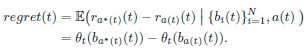

# CONTEXTUAL MULTI-ARMED BANDIT ALGORITHM FOR SEMIPARAMETRIC REWARD MODEL

## Abstract

Contextual multi-armed bandit(MAB)는 decision making task에서 누적 보상을 최대화하는 떠오르는 알고리즘이다. 대부분의 MAB는 보상과 action의 context를 linear relationship으로 가정한다. 해당 논문에서 제안하는 MAB는 제약이 적고 실행이 쉽고 빠르지만 linear reward model에서의 Thompson sampling과 같은 성능을 보였다. 

## Introduction 

MAB는 sequential decision problem 문제에서 모델이 주어진 환경에서의 각 스텝에서 행동을 선택하는데 있어서 보상의 누적합을 최대화하도록 학습하는 모델이다. 

* Action = arms of a bandit slot with multiple arm

Action을 취함으로써 모델은 다른 가능한 보상을 받게되고, 이를 반복함으로써 모델은 보상체계에 대해 정보를 축정하게 되며, 시간이 경과함에따라 최적의 arm을 선택하게 된다.

i.e. Yahoo의 뉴스기사 추천 알고리즘

이를 MAB를 대입하면, 가능한 기사들 중에 하나의 기사를 고르고, 이는 사용자가 방문한 목록에 쌓인다. 여기서 MAB의 목적은 사용자의 클릭의 누적합을 최대화 하는 것이고, 개별 방문시 마다 과거의 보상을 기반으로 전략을 강화한다. 

* available article = different action
* user click = reward

MAB의 도전과제는 이전에 시도해보지 않은 action에 대한 보상을 어떻게 처리하는지이다. 그래서 모델은 'exploitation'과 'exploration'의 균형을 맞추는 것이 중요하다.

기존의 MAB와 달리 의사결정시 side information을 사용하는 MAB를 Contextual MAB라고 한다. 예시에서는 방문자의 정보 뿐 아니라 뉴스기사를 context vector의 형태로 활용하는 것이다. 

그런데, MAB는 보상의 분포에 대한 강한 가정을 기반으로 정의하고 동작한다. 이는 특정 action의 보상의 기대값이 context vector와 **'time-invariant linear relationship'**을 가져야 한하는 것이다.

이 논문에서 제안하는 MAB는 보상의 분포에 대한 가정을 완화했다. 완화한 제약은 기존의 'time-invariant linear term'에 'additive intercept'를 활용하여 비정상성을 부여하는 것이다. 이 intercept는 시간에 따라 변하지만 action에 대해서는 변화하지 않는다. 그리고, context vector를 중앙화하여 선형적인 regression parameter를 지속적으로 추정한다. 그리고 이 방법은 마팅게일 불평등 방식을 활용하여 'high probability upper bound of the total regret'을 Thompson sampling 방식과 같게 추정함을 확인했다.

그리고 같은 비정상성을 가정으로한 MAB논문들과 비교했을때, 선택 확률에 대한 제약이 없고, 시간복잡도 또한 낮으며 모든 action들에 대한 선택의 분포를 명시적으로 보여주었다. 

## Prelimiaries

### 기호

There are N alternative actions, times t, i-th arm $(i=1,...,N)$

* $r_i(t)$: random reward(pull i action at t time)
* $\Theta_i(t)$: unknown mean with random reward
* $b_i(t)\in{R^d}$: finite-dimensional context vector associated with each arm i at time t
* $\Theta_i(t)=\Theta_t(b_i(t))$: the mean of $r_i(t)$ depends on $b_i(t)$
* $a(t)$: pull one arm
* $r_{a(t)}(t)$: reward with pulling one arm
* $a^*(t):=\underset{1\leq{i}\leq{N}}{argmax}\{\Theta_t(b_i(t))\}$
* $regret(t)$ : difference between the expected reward of the optimal arm and the expected reward of the arm chosen by the learner at time

MAB 모델의 목표는 T 스텝에 걸쳐 regret의 합을 최소화하는 것이다. 

**($R(T):=\sum^T_{t=1}regret(t)$)**

Linear contextual MAB는 action의 보상에 대한 기대값이 context vector에 대해 선형적임을 가정한다($\Theta_t(b_i(t))$ is linear in $b_i(t))$.

$$
\Theta_t(b_i(t)) = b_i(t)^T\mu, i=1,...,N
$$

$\mu\in{R^d}$는 알 수 없는 값이다. Linear Contextual MAB문제는 N이 무한이라고 하고 regret R(t)에 대해 $\Omega(d\sqrt{T})$의 복잡도를 가진다. 

Linear contextual MAB 문제를 위해 upper confidence bound(UCB) 알고리즘이 고안되었다. 이는 보상의 UCB값을 최대로하는 arm을 선택하는 알고리즘이다. UCB가 보상의 현재 추정치 뿐만 아니라 불확실성을 나타내기 때문에 exploitation과 exploration의 균형을 보장한다. UCB 알고리즘의 성공은 i번째 arm의 보상의 valid upper confidence bound $U_i(t)$, $b_i(t)^T\mu$에 달려있다. 

$$
U_i(t) = b_i(t)^T\hat{\mu}(t) + \alpha{s_{t,i}}
$$

$\hat{\mu}(t)$는 t시간의 $\mu$에 대한 회귀 추정치이다.

$$
\hat{\mu}(t) = B(t)^{-1}\overset{t-1}{\underset{\tau}{\sum}}{b_{a(\tau)}r_{a(\tau)}(\tau)}
$$

$B(t) = I_d + \sum^{t-1}_{\tau=1}b_{a(\tau)}(\tau)b_{a(\tau)}(\tau)^T$ and $s_{t,i}=\sqrt{b_i(t)^TB(t)^{-1}b_i(t)}$.

B(t)는 처음부터 t-1시점까지 수행한 action의 context vector들의 제곱. 

error가 $\eta_i(t):=r_i(t)-E(r_i(t)|b_i(t)) = r_i(t)-b_i(t)^T\mu$를 따르는 것과 같은 추가적인 제약을 통해 U_i(t)는 모든 i와 모든 t에 대하여 $b_i(t)^T\mu$의 $(1-\delta)$-probability upper bound 이다. 관측된 보상의 $\eta_{\alpha(\tau)}(\tau)$ error가 서로 관계가 있기 때문에 tight alpha값을 얻어내기 위해 'concentration inequality for vector-valued martingales' 방법을 활용했다. 추가적으로 적어도 $1-\delta$의 확률에서 UCB 알고리즘은 아래의 복잡도를 얻는다.

